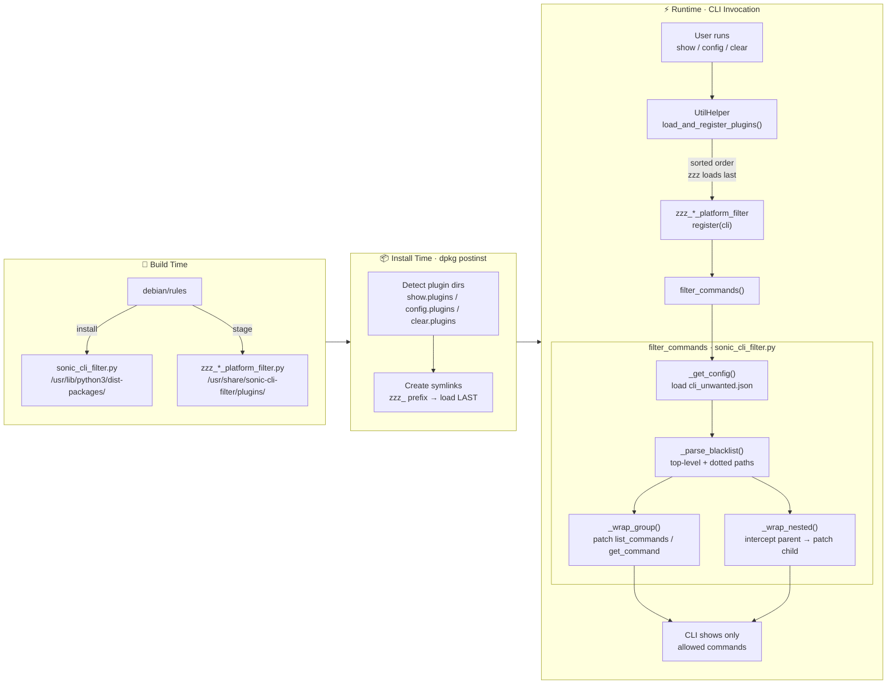

# sonic-cli-filter

Platform-specific CLI command filter for SONiC. Removes unwanted switch-oriented CLI commands (VLAN, VXLAN, NAT, BGP, etc.) from the SONiC `show` / `config` / `clear` CLIs based on a per-device JSON blacklist.

## Problem

SONiC is designed for data-center switches, so its CLI includes many commands that are irrelevant on certain platforms. Exposing these commands to operators causes confusion and may lead to misconfigurations.

## Solution

Use the **sonic-utilities plugin mechanism** to inject filter plugins that run **after** all other plugins have registered their commands, then **monkey-patch** the Click `Group` objects to hide blacklisted commands at runtime.

## Project Structure

```
sonic-cli-filter/
├── sonic_cli_filter.py                # Core filtering logic
├── plugins/
│   ├── zzz_show_platform_filter.py    # Plugin for "show" CLI
│   ├── zzz_config_platform_filter.py  # Plugin for "config" CLI
│   └── zzz_clear_platform_filter.py   # Plugin for "clear" CLI
├── debian/
│   ├── changelog
│   ├── compat
│   ├── control
│   ├── install
│   ├── postinst                       # Symlinks plugins into sonic-utilities
│   ├── prerm                          # Removes symlinks on uninstall
│   └── rules
└── README.md
```

Device-level configuration file (separate from this package):

```
device/<vendor>/<platform>/cli_unwanted.json
```

## Workflow

The end-to-end workflow involves **build-time packaging**, **install-time wiring**, and **runtime filtering**.

### Overview (Mermaid)



### Detailed Steps

```
┌──────────────────────────────────────────────────────────────────────┐
│                          BUILD TIME                                  │
│                                                                      │
│  debian/rules                                                        │
│    ├─ Install sonic_cli_filter.py                                    │
│    │    → /usr/lib/python3/dist-packages/                            │
│    └─ Stage plugin files                                             │
│         → /usr/share/sonic-cli-filter/plugins/                       │
└──────────────────────────────────────────────────────────────────────┘
                              │
                              ▼
┌──────────────────────────────────────────────────────────────────────┐
│                        INSTALL TIME (dpkg)                           │
│                                                                      │
│  debian/postinst                                                     │
│    ├─ Detect show/config/clear plugin directories via python3        │
│    └─ Create symlinks:                                               │
│         show.plugins/   ← zzz_show_platform_filter.py                │
│         config.plugins/ ← zzz_config_platform_filter.py              │
│         clear.plugins/  ← zzz_clear_platform_filter.py               │
│                                                                      │
│  (zzz_ prefix ensures these load LAST, after all other plugins)      │
└──────────────────────────────────────────────────────────────────────┘
                              │
                              ▼
┌──────────────────────────────────────────────────────────────────────┐
│                     RUNTIME (CLI invocation)                         │
│                                                                      │
│  1. User runs: show / config / clear                                 │
│                                                                      │
│  2. sonic-utilities UtilHelper.load_and_register_plugins()           │
│     iterates over all plugins in sorted order:                       │
│       aaa_plugin.py → ... → zzz_*_platform_filter.py (LAST)          │
│                                                                      │
│  3. zzz_*_platform_filter.py → register(cli) is called               │
│       → invokes filter_commands(cli_type, cli)                       │
│                                                                      │
│  4. filter_commands() in sonic_cli_filter.py:                        │
│     ┌──────────────────────────────────────────────────────────┐     │
│     │ a. _get_config()                                         │     │
│     │    ├─ Detect platform via sonic_py_common.device_info    │     │
│     │    ├─ Load /usr/share/sonic/device/<platform>/           │     │
│     │    │        cli_unwanted.json                             │     │
│     │    └─ Cache the result (loaded once per process)         │     │
│     │                                                          │     │
│     │ b. _parse_blacklist(cli_type)                            │     │
│     │    ├─ Extract top-level names:  "vlan" → {"vlan"}        │     │
│     │    └─ Extract dotted paths:  "ip.bgp" → {"ip": {"bgp"}} │     │
│     │                                                          │     │
│     │ c. _wrap_group(root_command, top_hidden)                 │     │
│     │    └─ Monkey-patch click.Group:                          │     │
│     │         list_commands() → filter out hidden names        │     │
│     │         get_command()   → return None for hidden names   │     │
│     │                                                          │     │
│     │ d. _wrap_nested(root, parent_name, child_hidden)         │     │
│     │    └─ For "ip.bgp": intercept get_command("ip"),         │     │
│     │       then patch the "ip" sub-group to hide "bgp"       │     │
│     └──────────────────────────────────────────────────────────┘     │
│                                                                      │
│  5. CLI renders only the allowed commands to the user                │
└──────────────────────────────────────────────────────────────────────┘
```

### Lazy Filtering

The filter wraps `click.Group.list_commands` and `click.Group.get_command` rather than deleting command objects. This means commands registered **after** the filter plugin loads are also hidden, as long as they match a blacklist entry.

## Configuration — `cli_unwanted.json`

Located at `/usr/share/sonic/device/<platform>/cli_unwanted.json`. Example:

```json
{
    "show": [
        "vlan",
        "vxlan",
        "nat",
        "ip.bgp",
        "ipv6.bgp"
    ],
    "config": [
        "vlan",
        "vxlan",
        "nat"
    ],
    "clear": [
        "nat",
        "watermark"
    ]
}
```

- **Top-level entries** (`"vlan"`) hide the command directly under the root group.
- **Dotted entries** (`"ip.bgp"`) hide a sub-command under a parent group — `ip bgp` is hidden while other `ip` sub-commands remain available.

## Dependencies

- `sonic-utilities-data` (provides the CLI framework and plugin directories)
- `sonic_py_common` (for `device_info.get_platform()` at runtime)

## Install / Uninstall

The package is built as a Debian `.deb` and installed via `dpkg`:

```bash
# Install
sudo dpkg -i sonic-cli-filter_1.0.0_all.deb

# Uninstall (prerm removes symlinks automatically)
sudo dpkg -r sonic-cli-filter
```
