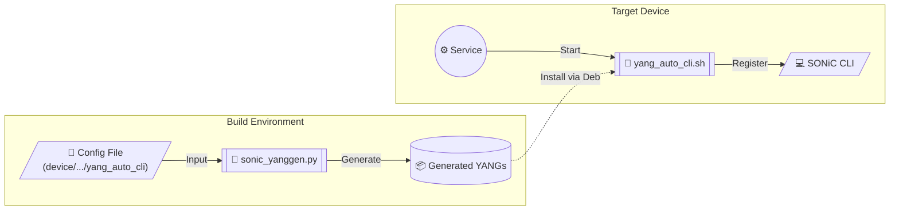

# SONiC YANG Generator Package

Automates the generation of SONiC YANG models from OpenConfig annotations and auto-generates CLI commands.

## Workflow



## Configuration (Required)

Create a configuration file at `device/<vendor>/<platform>/yang_auto_cli` to enable generation.

**Format**: `source-yang annotation-yang`
```text
# Example: device/molex/x86_64-otn-kvm_x86_64-r0/yang_auto_cli
openconfig-optical-attenuator.yang openconfig-optical-attenuator-annot.yang
```

## How It Works

1.  **Build Time**: 
    - Scans `device/` directory for `yang_auto_cli` config files.
    - Compiles `libyang` (and Python bindings) from source.
    - Converts specified OpenConfig annotations to SONiC YANG models using `sonic_yanggen.py`.
    - Packages generated files into `/usr/share/sonic/device-yang/<platform>/`.

2.  **Runtime**: 
    - `sonic-yanggen.service` runs on startup.
    - Executes `yang_auto_cli.sh` to register CLI commands.
    - **Safe**: Only processes files specifically generated for this platform to avoid conflicts with system CLI.

## Troubleshooting

- **Build Logs**: Check build output for "Auto-Discovery" and "Building libyang".
- **Runtime Logs**: `/var/log/sonic-yanggen.log`
- **Service Status**: `systemctl status sonic-yanggen`

## Components

- **sonic_yanggen.py**: Python script for YANG transformation (Build-time only).
- **yang_auto_cli.sh**: Bash script for CLI registration (Runtime).
